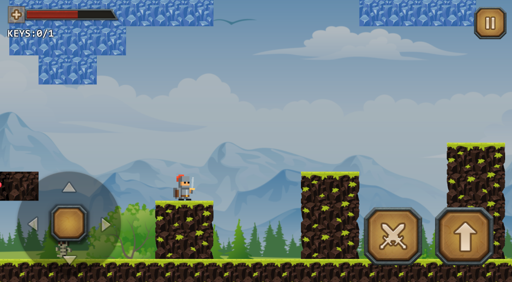
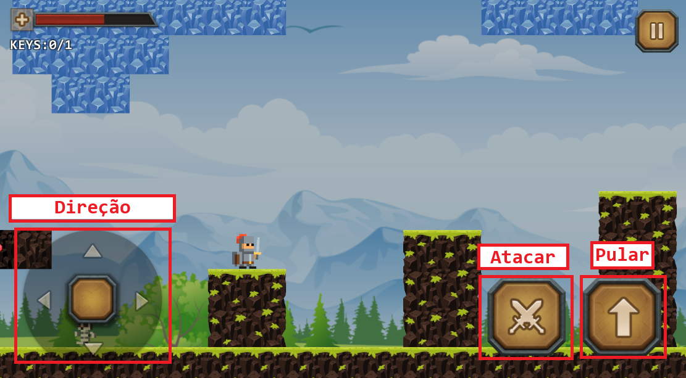
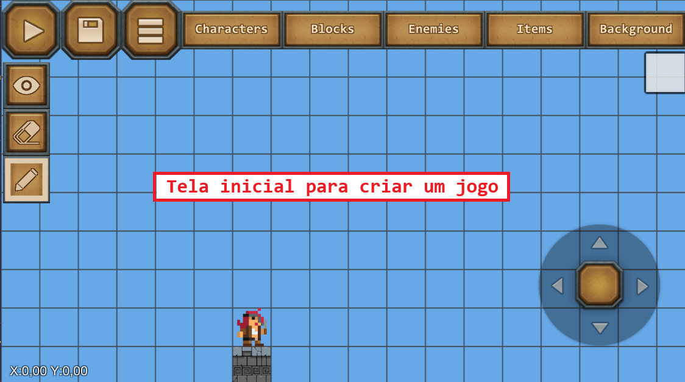
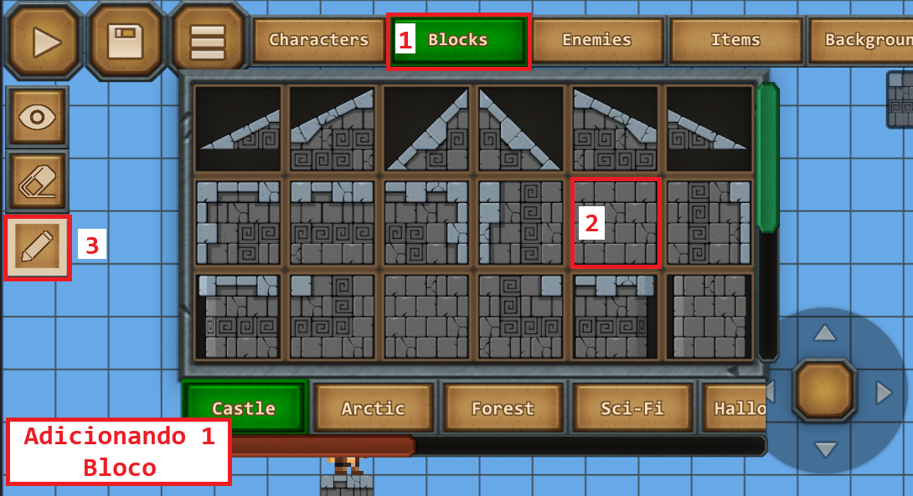

### Cartilha: Aprendendo a Criar Jogos no Epic Game Maker

**Olá! Esta cartilha é para você que tem Síndrome de Down e quer aprender a usar o Epic Game Maker. É um jogo divertido onde você cria níveis como um super-herói!**

**Para o tutor:** Use esta cartilha com o aluno. Leia devagar. Mostre as imagens. Faça os exercícios juntos. Repita se precisar. Incentive com elogios!

**Dicas gerais:**
- Use o dedo na tela do celular Android.
- Jogue devagar.
- Se errar, tente de novo. Está tudo bem!

#### Parte 1: O que é o Epic Game Maker?
Epic Game Maker é um app grátis no celular. Você cria mundos 2D com blocos, personagens e monstros. Como brincar de Lego, mas no jogo!

**Imagem sugerida:** Uma tela do jogo com blocos coloridos e um personagem pulando. (Placeholder: [Imagem de blocos e personagem]. Se você quiser que eu gere imagens personalizadas para esta cartilha, por favor confirme para prosseguir com a criação visual.)

**Exercício 1:** 
- Baixe o app na loja Google Play.
- Abra o app.
- Olhe a tela inicial. O que você vê? (Resposta: Botões para jogar ou criar.)
- Com o tutor: Desenhe no papel o que viu.

#### Parte 2: Como Jogar Níveis Prontos
Você pode jogar níveis feitos por outros. É fácil!

Passos:
1. Abra o app.
2. Clique em "Jogar".
3. Escolha um nível da lista.
4. Use o lado esquerdo da tela para andar.
5. Use o lado direito para pular e atacar.

**Imagem sugerida:** Captura de tela mostrando os controles: seta esquerda/direita, botão de pulo e ataque. (Placeholder: [Imagem dos controles no celular]. Confirme se deseja geração de imagens.)

**Exercício 2:**
- Jogue um nível simples.
- Conte quantas vezes pulou. (Escreva aqui: ____ )
- Com o tutor: Fale o que gostou no nível.

#### Parte 3: Criando Seu Próprio Nível
Agora, crie! Use o editor. É como desenhar.

Passos:
1. Clique em "Criar".
2. Veja a grade vazia (como quadradinhos).
3. Toque em um quadradinho e escolha um bloco (chão, parede).
4. Adicione personagens: cavaleiro, goblin.
5. Adicione itens: chave, porta.
6. Clique em "Salvar" e teste.

**Imagem sugerida:** Passo a passo visual: Grade vazia > Adicionando bloco > Nível pronto. (Placeholder: [Sequência de imagens do editor]. Peça confirmação para gerar imagens.)

**Exercício 3:**
- Crie um nível pequeno: Um chão, um personagem, uma porta.
- Teste: Você conseguiu passar? Sim / Não.
- Com o tutor: Mude uma coisa e teste de novo.

#### Parte 4: Compartilhando e Jogando com Amigos
Envie seu nível para outros verem!

Passos:
1. Termine o nível.
2. Clique em "Enviar para servidor".
3. Dê um nome simples, como "Meu Mundo".
4. Busque níveis de outros: Use palavras como "fácil" ou "divertido".

**Imagem sugerida:** Tela de compartilhamento com botão "Enviar" e lista de níveis. (Placeholder: [Imagem da tela de compartilhar]. Confirme para imagens geradas.)

**Exercício 4:**
- Envie um nível seu.
- Jogue um nível de outro jogador.
- Diga ao tutor: Foi fácil ou difícil? Por quê?

#### Parte 5: Dicas para Divertir Mais
- Classes de personagens: Guerreiro (forte), Arqueiro (atira), Mago (mágica).
- Evite anúncios: Peça ao tutor para remover se puder.
- Se bug: Feche e abra de novo.

**Exercício 5:**
- Escolha uma classe: ____ (guerreiro, arqueiro, mago).
- Crie um nível com ela.
- Com o tutor: Jogue juntos em modo multiplayer (até 4 amigos).

**Fim da cartilha! Parabéns! Você é um criador de jogos. Pratique todo dia. Se precisar de ajuda, pergunte ao tutor.**

**Para o tutor:** Monitore o progresso. Adapte exercícios se o aluno precisar de mais repetição. Use recompensas como stickers. Se quiser mais páginas ou ajustes, diga! Para as imagens, confirme se deseja que eu gere visuais personalizados baseados nessas descrições.