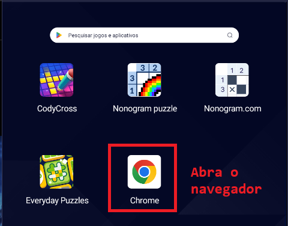
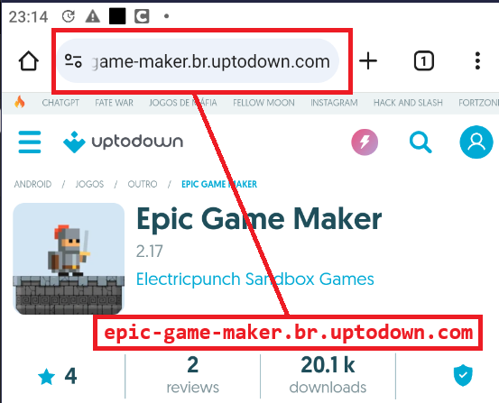
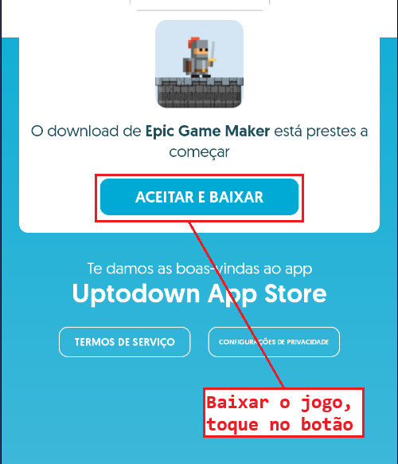
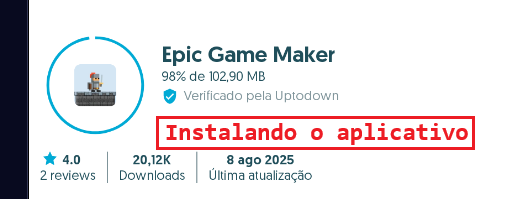

# Tutorial: Como Instalar e Usar o Epic Game Maker

Este tutorial ensina como instalar e jogar o **Epic Game Maker** no celular ou tablet Android. Ele é simples para crianças e pais entenderem. Vamos usar imagens para ajudar!

## O que você precisa
- Um celular ou tablet Android (com Android 7.0 ou mais recente).
- Conexão com a internet.
- Um adulto para ajudar.

---

## Parte 1: Instalar o Epic Game Maker

### Passo 1: Acesse o site da Uptodown
1. Abra o **navegador** (como o Google Chrome) no celular.
2. Digite na barra de endereço: **epic-game-maker.br.uptodown.com**.
3. Toque em "Ir" ou na tecla de busca.

**Imagem 1**: Tela do navegador com o endereço `epic-game-maker.br.uptodown.com` na barra.
- *Como obter*: Abra o Chrome, digite o endereço e tire uma captura de tela (pressione **Power + Volume Down**).
- *Para a criança*: "Olha, essa é a tela onde escrevemos o endereço do jogo!"

**Para os pais**: Use o site oficial da Uptodown para segurança.

### Passo 2: Baixe o aplicativo
1. Na página, toque no botão verde **"Baixar"**.
2. Se aparecer um aviso, toque em **"Baixar mesmo assim"**.

**Imagem 2**: Página da Uptodown com o botão verde "Baixar" destacado (com um círculo vermelho).
- *Como obter*: Acesse o site, localize o botão "Baixar" e tire uma captura de tela.
- *Para a criança*: "Você vê esse botão verde? Toque para pegar o jogo!"

**Para os pais**: Se o celular pedir permissão para "fontes desconhecidas", vá em **Configurações > Segurança** e ative para o navegador.

### Passo 3: Instale o aplicativo
1. Abra a pasta **Downloads** no celular.
2. Toque no arquivo "Epic Game Maker APK".
3. Toque em **"Instalar"** e espere.

**Imagem 3**: Pasta de Downloads com o arquivo "Epic Game Maker APK" e o botão "Instalar".
- *Como obter*: Após o download, abra a pasta Downloads e tire uma captura de tela.
- *Para a criança*: "O jogo está entrando no celular! Vamos esperar um pouquinho."

**Para os pais**: O aplicativo é leve (cerca de 100 MB). Verifique se há espaço no celular.

### Passo 4: Abra o Epic Game Maker
1. Toque em **"Abrir"** após instalar ou procure o ícone na tela inicial.

**Imagem 4**: Tela inicial do celular com o ícone do Epic Game Maker (um bonequinho ou tema de jogo).
- *Como obter*: Após instalar, localize o ícone na tela inicial e tire uma captura de tela.
- *Para a criança*: "Você vê esse desenho com um bonequinho? Toque para abrir!"

---

## Parte 2: Como Jogar no Epic Game Maker

### Passo 1: Escolha um nível para jogar
1. No aplicativo, toque em **"Jogar"** para ver níveis de outras pessoas.
2. Use a lupa (busca) e digite **"fácil"** ou **"divertido"** para encontrar jogos simples.

**Imagem 5**: Menu principal do Epic Game Maker com o botão "Jogar" destacado.
- *Como obter*: Abra o aplicativo, vá ao menu inicial e tire uma captura de tela.
- *Para a criança*: "Aqui tem muitos jogos! Toque aqui para escolher um."

**Imagem 6**: Tela de busca com a palavra "fácil" digitada na barra.
- *Como obter*: Toque na lupa, digite "fácil" e tire uma captura de tela.
- *Para os pais*: Escolha níveis simples para a criança.

### Passo 2: Controle o personagem
1. Use as **setas** (lado esquerdo) para mover.
2. Toque no botão de **pular** ou **atacar** (lado direito).

**Imagem 7**: Tela de um nível com controles (setas à esquerda, botões de pular/atacar à direita).
- *Como obter*: Entre em um nível simples, jogue um pouco e tire uma captura de tela.
- *Para a criança*: "Use o dedo aqui para andar e aqui para pular. Vamos tentar!"

**Para os pais**: Ajude a criança a praticar os controles.

### Passo 3: Divirta-se explorando
1. Tente chegar ao final do nível sem cair.
2. Se for difícil, volte ao menu e escolha outro nível.

**Imagem 8**: Tela de um nível colorido com o personagem pulando ou coletando uma moeda.
- *Como obter*: Jogue um nível fácil e tire uma captura de tela.
- *Para a criança*: "Se não der certo, tudo bem! Vamos tentar outro jogo legal."

---

## Parte 3: Como Criar um Jogo no Epic Game Maker

### Passo 1: Escolha a opção de criar
1. No menu inicial, toque em **"Criar"**.

**Imagem 9**: Menu principal com o botão "Criar" destacado.
- *Como obter*: Volte ao menu inicial e tire uma captura de tela.
- *Para a criança*: "Agora você vai fazer seu próprio jogo, como um supercriador!"

### Passo 2: Monte o cenário
1. Na grade (quadrados), coloque:
   - **Chão** (para andar).
   - **Blocos** (para paredes ou plataformas).
   - **Itens** (como moedas) ou **inimigos**.
2. Toque em um item na barra de ferramentas e depois na grade.

**Imagem 10**: Editor de níveis com a grade e a barra de ferramentas (chão, blocos, moedas).
- *Como obter*: Entre no modo "Criar", selecione itens e tire uma captura de tela.
- *Para a criança*: "Vamos colocar um chão aqui e uma moeda ali. O que mais você quer?"

**Para os pais**: Ajude a escolher itens simples.

### Passo 3: Teste seu jogo
1. Toque em **"Jogar"** ou **"Testar"** (ícone de play).
2. Jogue o nível que você criou.

**Imagem 11**: Nível criado com o personagem jogando e o botão "Testar" viskeyboard: visível.
- *Como obter*: Crie um nível simples, toque em "Testar" e tire uma captura de tela.
- *Para a criança*: "Vamos jogar o seu jogo! Veja como ficou divertido!"

### Passo 4: Salve e compartilhe (opcional)
1. Toque em **"Salvar"** (ícone de disquete ou check).
2. Compartilhar é opcional.

**Imagem 12**: Editor de níveis com o botão "Salvar" destacado.
- *Como obter*: Após criar um nível, localize o botão "Salvar" e tire uma captura de tela.
- *Para os pais*: Evite compartilhar para manter a experiência privada.

---

## Dicas Extras para Pais

1. **Guia visual**:
   - Use as imagens para criar um caderno ou documento. Mostre cada imagem enquanto explica.
   - Imprima as capturas de tela e cole com instruções curtas.

2. **Apoio para Crianças com Síndrome de Down**:
   - Aponte para as imagens enquanto explica (ex.: "Toque aqui no botão verde!").
   - Elogie pequenos passos, como: "Você encontrou o botão! Que legal!"

3. **Segurança**:
   - Baixe apenas do site **epic-game-maker.br.uptodown.com**.
   - Não crie conta, a menos que necessário, e supervisione.

4. **Diversão**:
   - Jogue junto com a criança, usando as imagens como guia.
   - Escolha níveis coloridos e simples.

---

## Resumo Visual para a Criança
1. **Instalar**: Toque no botão verde (Imagem 2) e instale (Imagem 3).
2. **Jogar**: Escolha um nível (Imagem 5) e use os controles (Imagem 7).
3. **Criar**: Coloque blocos e moedas (Imagem 10) e teste (Imagem 11).

*Para a criança*: "Vamos fazer um jogo superlegal? Olha as imagens para ajudar!"

---

## Como Criar as Imagens
1. **Capturas de tela**:
   - No Android, pressione **Power + Volume Down** para tirar capturas de tela em cada passo.
   - Salve as imagens em uma pasta (ex.: `Imagens/Tutorial_EpicGameMaker`).
   - Substitua os placeholders (ex.: `caminho/para/imagem1.png`) pelos caminhos reais (ex.: `Imagens/imagem1.png`).

2. **Alternativa**:
   - Pesquise no Google por "Epic Game Maker screenshots" em sites confiáveis, como Uptodown.
   - Ou peça a alguém para desenhar ilustrações simples dos botões e telas (ex.: botão verde "Baixar" ou grade do editor).

3. **Organização**:
   - Nomeie as imagens de forma clara (ex.: `imagem1_navegador.png`, `imagem2_botao_baixar.png`).
   - Coloque todas em uma pasta acessível para inserir no documento Markdown.
